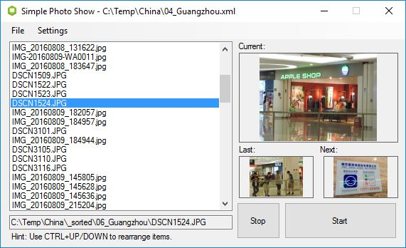
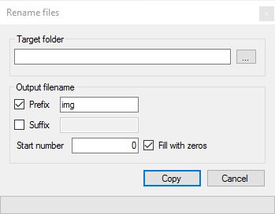

# SimplePhotoShow
 A simple photo slide show program, written in C#.
 
 - Uses the filepath of the images
 - Save and load compilations
 - Plays videos using Windows Media Player
 - Can rename-copy a compilation to a different folder
 
  Screenshot of main window:

 
 Screenshor of rename-copy window:

 
Compiled version for [download](SimplePhotoShow.zip)
